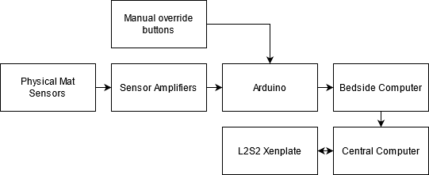
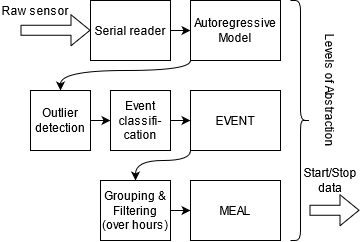
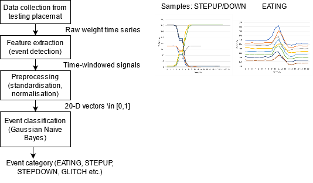

# GM1_G3

A solution for nutrition and hydration monitoring for patients in hospital care. This repo contains the code for the sensor processing, event detection, machine learning, information processing, API interaction parts of the project.

## Overview

## Implementation

Figure 3: design of information processing subsystem in terms of actions needed.

The bedside computer contains Python scripts that continually read from the serial bus connected to the Arduino. Then, it is appended to a moving buffer representing the autoregressive model of Figure 3. Event detection is done by a simple z-score test which starts an event if a new reading is an outlier. An event classification algorithm using machine learning was implemented, which learns from a dataset of different events (e.g. “Eating”, “Step Up”, “Step Down”, “Glitch” - see Figure 5) taken from the placemat recordings and predicts the category given new events. The dataset was collected from mechanical tests involving eating various meals off the mat, and placing and removing objects. First, the whole detected events are used as features for the algorithm. These features are standardised to 20 dimensions and normalised to between 0 and 1. No dimensionality reduction was used, although that could be scope for further work. Then, a simple Gaussian Naive Bayes classifier was used which achieved 100% accuracy on our test-set. The algorithm was integrated into the prototype and achieves realistic classification when using the placemat normally.

Figure 5: Machine learning pipeline to classify events (i.e. what’s happening on the placemat). Right, examples of raw unprocessed samples (showing steps and eating events).

Meal grouping would ideally work on the scale of hours. Since meal frequency is very low (3 a day), the system will always have improved accuracy if it has a long inactivity timeout. For demonstration purposes we use a button to force end. Therefore this avoids having to wait for the system to recognise the end of a meal during demonstration!

A simple rule was used to output the final weight of food eaten - the food eaten is counted as the final minus the initial weight, minus any offset given by the weight difference of detected STEP events. This allows the eaten food, but not phones, glasses etc. placed on the mat, to be measured.

### Problem statement
The 2014 Chief nursing officer for England, Jane Cummings, stressed that nutrition and hydration are fundamental aspects of nursing practice for all ages. However, malnutrition is an increasingly severe problem in the UK with over 3 million affected annually, 25% to 34% of patients in hospitals, with associated health costs of over £13 billion per annum [1]. Malnutrition and dehydration are both easily preventable conditions, and have associated morbidity, mortality and impaired quality of life in institutional care settings such as hospitals, nursing homes and care homes. However, in these very settings, this problem sometimes passes unnoticed - especially in the most vulnerable patients with long-term conditions. Failure of nutritional screening practices to identify at-risk patients and inadequate documentation, in part due to staff shortages, has led to delayed or absence of nutritional interventions, increased complications and worsened recovery. [2] In this project, we are hoping to improve the accuracy, time-cost and efficiency of nutritional and hydration screening in a cost-effective manner within a hospital-setting, with a view to making the system suitable for care home settings as well.
